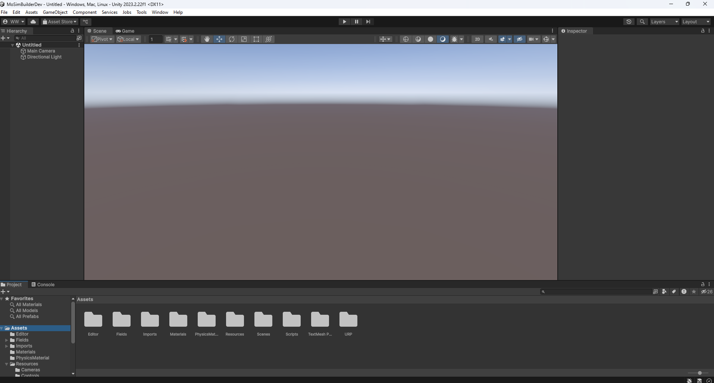
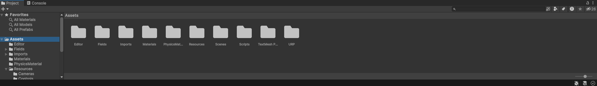
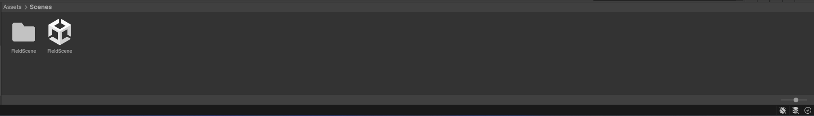
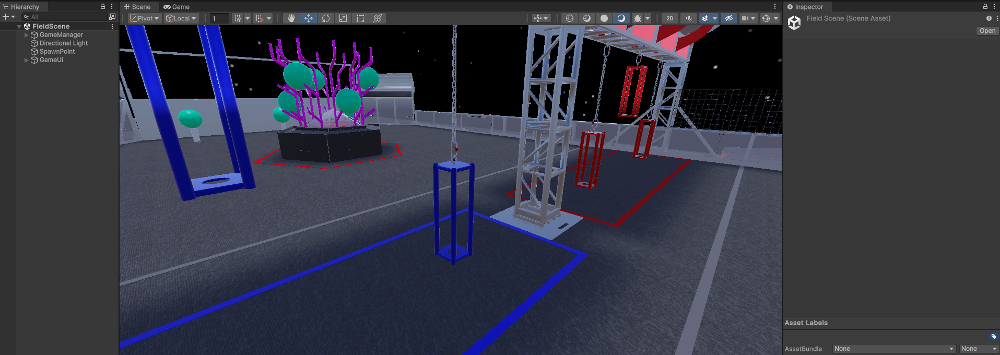
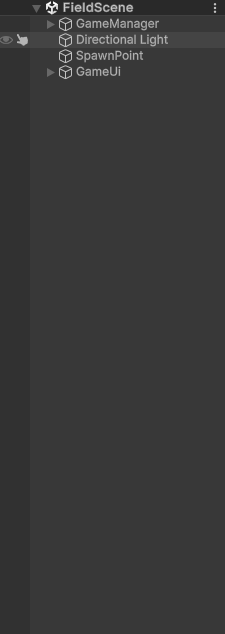
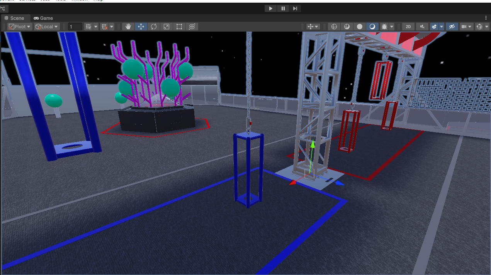
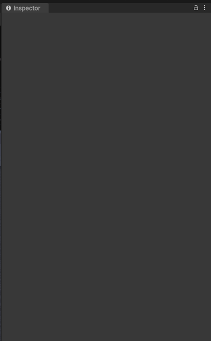
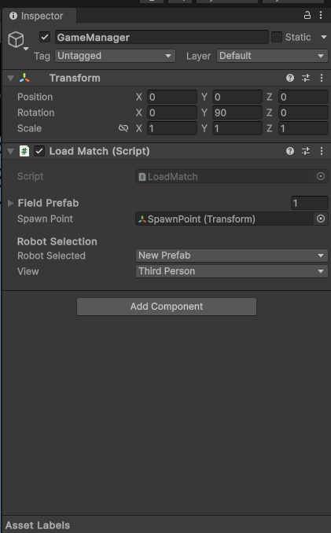
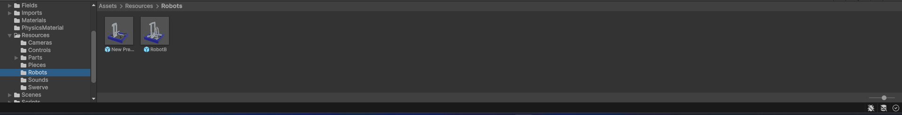

## Familiarizing

* Once the project is open, you will see something similar to the image below.
  
* At the bottom of the screen (as shown in the below image) is our `Project Window`. This is where files are
  stored
  
* On the left side is the `Folder List`, this is for quick access to specific folders
* In the middle is the `File Explorer` where you can see and modify files by clicking on them
* Now, scroll down in the `Folder List` and then click the `Scenes` folder to open it
  
* The photo above shows the `File Explorer` after opening the `Scenes` folder. Double-click the file named `Field` (With the unity icon)
* This filetype is known as a `Scene`. Scenes are playable zones, and thus where we will return to when running robots
* Double-click the `Field Scene` to load the play scene for builder
  
* Looking back up to the center of the screen, we can see three areas:
  * The `Hierarchy` located on the left
  * The `Scene/Game View` in the middle with the `Play Button` right above it
  * And the `Inspector` to the right.
  
 
* In the Hierarchy we see a few things: `GameManager`, `Directional Light`, `SpawnPoint`, and `GameUi`.
    * The `GameManager` is where the field and robots are set
    * The `Directional light` is the light shone on the field
    * `SpawnPoint` is the position that the robots will spawn in at
    * `GameUi` manages the UI and other static elements
      

* The `Scene/Game View` is where the work is actually done
* The `Play`, `Pause` and `Step` buttons located above the `Scene View` are what spawns the robots and initializes
  gameplay
  
 
* This brings us to the final tab, the `Inspector` window. When you select an object using either `Scene View` or the
  `Hierarchy` this window on the right side of the screen will populate with the "components" of the object.
    * When you select the `GameManager` object in the `Heirarchy` (left click) the `Inspector` menu will populate with
      its components, as shown below:
      
      
    * This is where the bulk of the changes will occur.
    * The first "Component" of interest is the `LoadMatch` script. In it we have:
        * The field prefab to be used. To select a field, just drag it to the top of the list
        * The spawn point to use. This is defaulted to the premade `SpawnPoint` from the field scene
        * The robot selector. Each robot from the `Resources -> Robots` folder will be automatically added to the
          dropdown list
        * The view type

      
* Finally we return to the `Project View` and open the `Resources` folder, then the `Robots` folder. This is where all
  the robots are located.
  (Photo does not necessarily include all robots)
    * There is no requirement that the names of the robots be numbers, however there can be no duplicate names
    * All robots are automatically added to the robot selector list in the `GameManager`
    * To play, select the desired robot and click the `Play` button above the `Scene View`
    * Controls? Whatever you make them.
 
  # [First Robot](FirstRobot.md)
