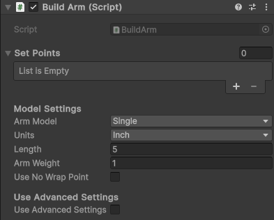
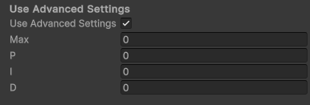
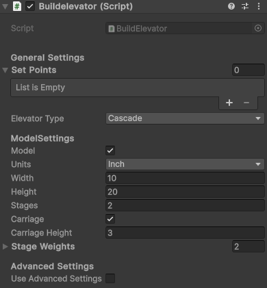

# Build Mechanism

### Builder Beta currently has two available mechanisms

* Arms
* Elevators

## Building Arms

* To create an arm first create a new game object and then add a `BuildArm` script to it
  
* You'll see multiple sections with many options to choose from:
    * `Set Points`: This is where you can add [Setpoints](Setpoints.md) to your mechanisms
    * `Model Settings`:
        * `Arm Model`: The model type to use for the mechanism. The Arm mechanism uses various tubing types to visualize
          the arm. If you don't want it to use tubing, select `none`. You'll be able to add more parts from the
          `Part Library` to the mechanism later
        * `Units`: The units to use for the model size
        * `Length`: The length of the tubing model
        * `Weight`: The weight of the mechanism in lbs
        * `Use No Wrap Point`: Whether the mechanism should have an angle that it can't cross. If the box is checked, a
          box will be added for the angle in degrees to not cross
    * `Advanced Settings`: Allows custom PID control of the mechanism for tuning max speeds and tweaking behaviour. Most
      mechanisms won't need these
      
        * `Max`: The maximum speed that the mechanism can move
        * `PID`: The custom PID gains for the mechanism to use
* Once you've finished configuring and placing the arm don't forget to [make it pretty](MakingItPretty.md)
* When adding parts from the `Part Library` to the arm, make sure you place the game objects under the arm object in the
  `Heirarchy`. This way the parts will rotate with the arm instead of staying still relative to the robot while the arm
  moves

## Building Elevators

* Creating an elevator is almost exactly the same as creating an arm
* Start by creating a new game object and adding a `BuildElevator` script to it
  
* You should see sections very similar to the ones from the `BuildArm` script:
    * `General Settings`:
      * `Set Points`: This is where you can add [Setpoints](Setpoints.md) to your mechanisms
      * `Elevator Type`: The rigging of the elevator, Cascade or Continuous
    * `Model Settings`:
        * `Model`: If a model should be created for the elevator. If unchecked, no model will be made, but the elevator will still move to the setpoints
        * `Units`: The units to use for the model size and the setpoint positions
        * `Width`: The width of the outermost stage of the elevator model
        * `Height`: The height of the outermost stage of the elevator model
        * `Stages`: The number of stages that the model should have, not including the outermost "stationary" stage
        * `Carriage`: Whether the elevator's innermost stage should be a "carriage". A carriage stage is a smaller internal stage that moves inside the previous stage and is enclosed by it on the top and bottom
        * `Carriage Height`: Only appears if `Carriage` is selected. The height of the carriage model
    * `Stage Weights`: The weights of each stage of the elevator. Stage 0 is the outermost stage (not including the "stationary" stage), Stage 1 is the next most outwards, and so on
    * `Advanced Settings`: Allows custom PID control of the mechanism for tuning max speeds and tweaking behaviour. Most
      mechanisms won't need these
      
        * `Max`: The maximum speed that the mechanism can move
        * `PID`: The custom PID gains for the mechanism to use
    * Once again to beautify it make sure that the parts are placed under the desired stage in the `Hierarchy`

# [Further Reading](FurtherReading.md)
