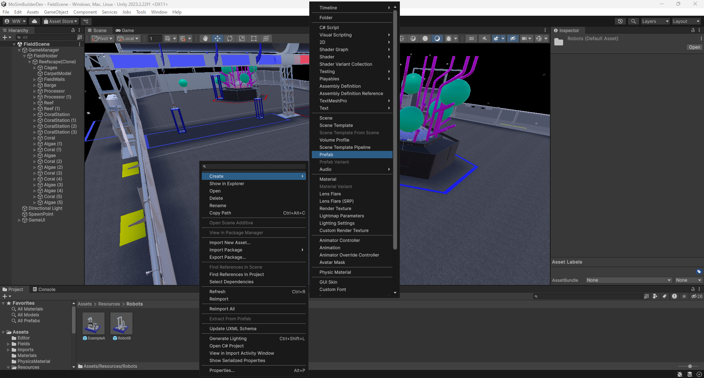
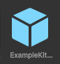
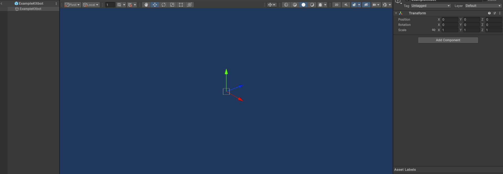
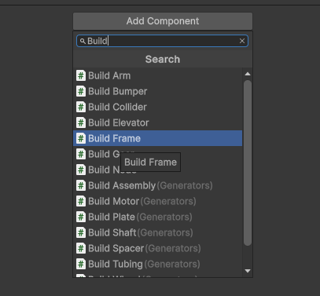
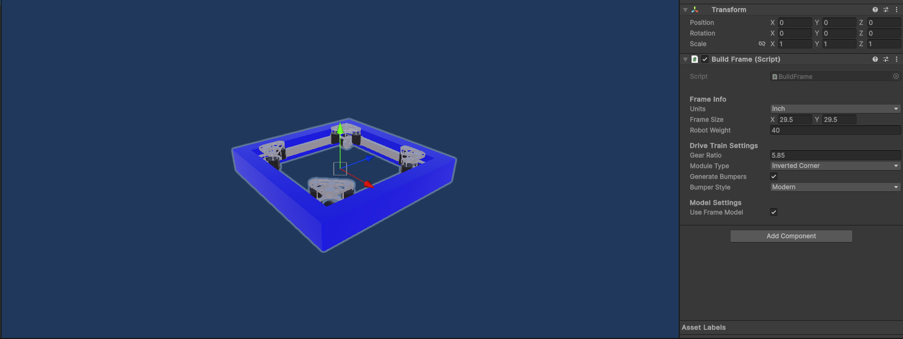
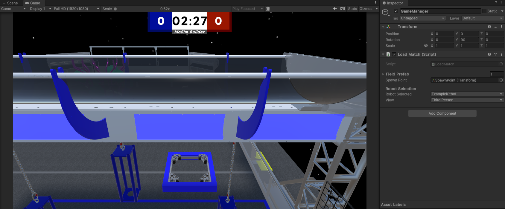
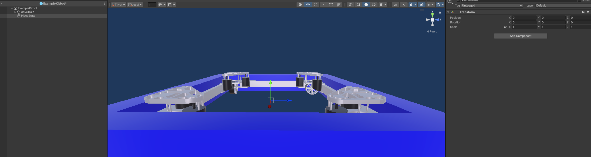
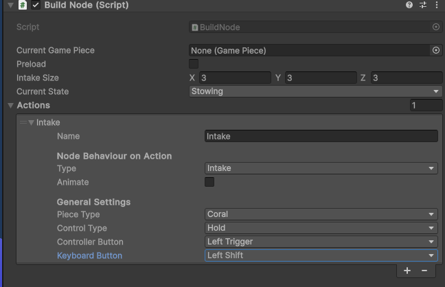
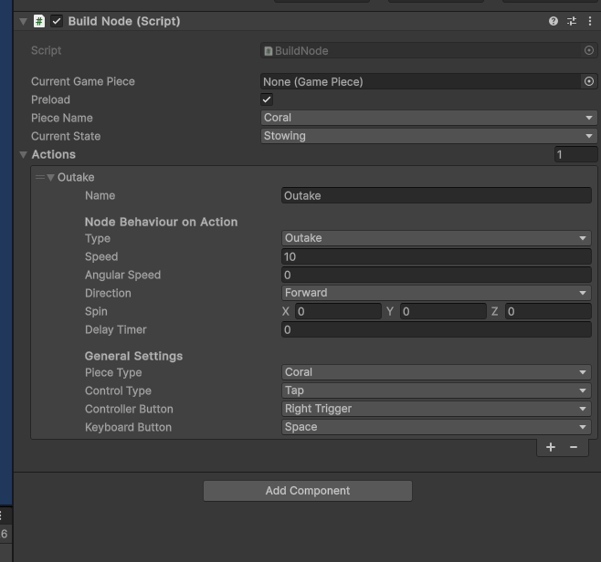

# Creating Your First Robot

## Adding a robot

* In the `Resources -> Robots` folder, right-click the `Project View`
* Select `Create -> Prefab`. Prefabs are separate objects, which in this case, is the robot
  

* Name the prefab however you'd like. This is your robot's name
* This should create a new prefab object with a cube icon as shown below
  
 

## Setting up the DriveTrain

* Double-click the prefab you just created to open it up the editor (NOTE: this will replace the field editor on the
  screen, but don't worry, you can click the back arrow on the top left of the `Hierarchy` to go back)
* The editor is how robots are altered
* It is recommended to disable auto save which is found in the top right of the `Scene View` to avoid any major issues
  and reduce load time (Don't forget to save frequently though)
* To start creating the actual robot, select the object at the top of the `Hierarchy` to open the `Inspector` window
  
 

* Next click `Add Component` to open the component menu. Search for `Build` to find a plethora of build scripts. For
  now, you'll just need to select `BuildFrame`
  
 
  
* You may be a ways away from the frame, simply double-click the new entry in the `Heiarchy` driveTrain to zoom in
* Now you can see the frame you just made
  
  

* The `Inspector` window will have now also changed featuring the `Build Frame` script and some parameters for
  customization
* For this tutorial robot, we'll just keep the default values
* As the parameters are updated in the script, the frame model should update in accordance to the new parameters
* You can already return to the `Field Scene` (remembering to save) and select your robot from the `GameManager` drop down
* Once done you can click play and drive your robot around

  

## Basic Game Piece Manipulation

* Right-click the base object in the `Hierarchy` (Named with your robot name), and select `Create Empty` to create a
  component
* Name the component whatever you'd like (`PieceState` in the example below)
 
  <h3>Intake</h3>
* To create the intake collider, you'll need to use the `BuildNode` script
* Select the object in the `Hierarchy` and click `Add Component`, just like what was done in the Drive Train creation
* This time, instead of selecting the `BuildFrame` script, select the `BuildNode` script
* This should add the `BuildNode` script to the `Inspector` window for that object
* add an action to the actions state
* Set the name to Intake, then in general settings change the control type to Hold, the controller button to left Trigger, and keyboard to left Shift.
  
* Finally set the intake size to 28, 6, 6
* move it to position (0, 0.907, -0.272)

  <h3>Stow</h3>
* add another state to the node, and name it Transfer.
* Set the Type to Transfer, then change the control type to Always Perform

  <h3>Outtake</h3>
* Now add another GameObject and name it Outake State
* set the position to (0, 0.608, 0.329)
* set the rotation to (0,-90,0)
* Add a Build Node
* Add an action named outake
* Check Preload
* Set the Type to Outake, Speed to 80
* angular speed 0,
* set the control type to tap
* controller button to right trigger, keyboard to space.

* now return to piece state, and on the move To slot on Transfer, drag OutakeState on it.

* Now select the Root of the prefab and add a spawn Piece Target, set the Type to distance
* the set spawn distance to 1.43
* set velocity to 5

And now you're done! Click the back arrow on the top left of the `Hierarchy` (Save first!) to return to the `Field Scene` and start playing with your robot

## Playing with the robot.

* Select `GameManager` in the `Hierarchy` and select your robot from the robot selector.
* Also in `GameManager` open the `Fields` dropdown and ensure that your desired field is on the top of the list (by dragging it to the top)
* Optionally select the camera perspective as well
* When you're ready, click the `Play` button on top of the `Scene View` to start playing!

# [Next step](MakingItPretty.md)

