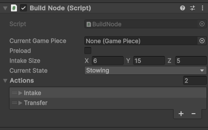
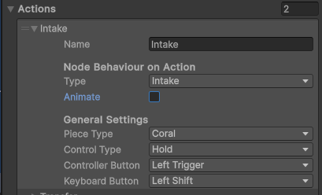
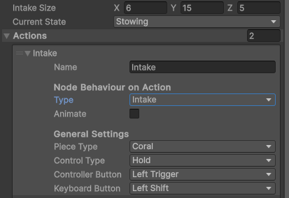
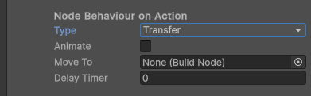
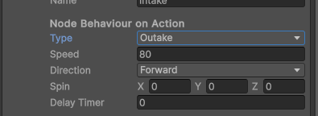

# Game Pieces

## Builder Beta uses a setpoint-esque system for game piece interactions

<h5>`Build Node` is the home for all of builder's game piece functionality</h5>

Build Node operates on a system similar to the [Setpoint System](Setpoints.md) used by mechanisms.

### Basic Settings

The system makes heavy usage of `hidden settings` which are new to the beta. This allows the information you need and
only the information needed to be displayed.
By default there will be a `CurrentGamePiece` `Preload` and `CurrentState`. `CurrentGamePiece` and `CurrentState` are
both debug and should be left as is. When Preload is checked a new line for what piece to spawn is added

### Actions

`Actions` are the core of the game piece system. These can be added by opening the dropdown and selecting the `+` at the
bottom

`Actions` have several configurations:

* `Name`
* `Type`
* `Animate`
* `PieceType`
* `ControlType`
* `ControllerButton`
* `KeyboardButton`

##### Other options will appear and disappear depending on which core settings are selected

### Name

Has no effect on the action itself, but helps with organization and cleanliness

### Type

`Type` determines the actual behaviour that `Action` carries out. There are currently three action types: `Intake`
`Transfer` and `Outake`

* `Intake` - Allows indexing a piece into the robot. Also adds the following settings:
    * `Animate` - Allows you to animate the motion from the point of contact to the `BuildNodes` center. The specifics
      are
      explained in a later section
    * `Size` - The range that the intake should function in. Spawns a new box collider child. You can use the `Size` box
      to resize the collider and manually move the child to change the position.
      
      

* `Transfer` - Allows transferring game pieces between nodes on the robot. Also adds the following settings:
    * `Animate` - Allows you to animate the motion between two `Nodes`. The specifics are explained in a later section
    * `MoveTo` - Decides which `Node` to transfer the game piece to. Drag the object with the desired `Node` from the
      `Heirarchy` into this slot to assign it
    * `Delay Timer` - Sets a delay period before the transfer occurs

* `Outake` - Releases the game piece from the robot. Also adds the following settings:
    * `Speed` - Velocity of the release
    * `Direction` - The direction to apply velocity in when the game piece is released. Can be Up, Left, and Forward, with the opposites just being negative values
    * `Spin` - Angular velocity of each axis applied on release
    * `Delay Timer` - Sets a delay period before the game piece is released

### Animations

* Some settings have a checkbox for enabling animations. Selecting it add two new fields: `Speed` and `Angular Speed`
* `Speed` is the linear velocity of the game piece throughout the animation
* `Angular Speed` is the angular velocity
* Animations are intended as an extra setting, and thus not completely stable in all situations
* Enabling Animations on an intake makes it `breakable` so if the distance increases instead of decreases the animation `breaks` and retruns the piece to the world

### Piece Type

* Controls the game piece type that the `Node` should interact with
* **NOTE**: a single `Node` can interact with multiple game piece types. The `Node` itself doesn't possess a piece type, but rather the `Action` inside the `Node` does

### Controls

* There are three `Control Types`
    * `Tap` - attempts to perform the action the frame it is pressed and only that frame
    * `Hold` - attempts to perform the action the entire time it is held
    * `Always Perform` - always attempts to perform the action
* Each action can only be bound to one of each, controller and keyboard button
* Controls are `per input device` which means you have access to all NON HARDCODED buttons for each input style.
    * **NOTE**: Controller is Xbox layout

# [Further Reading](FurtherReading.md)
