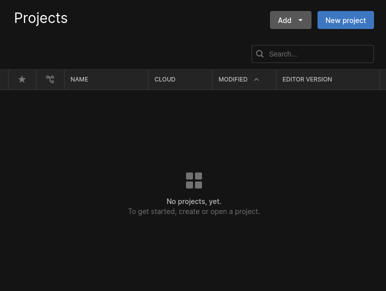
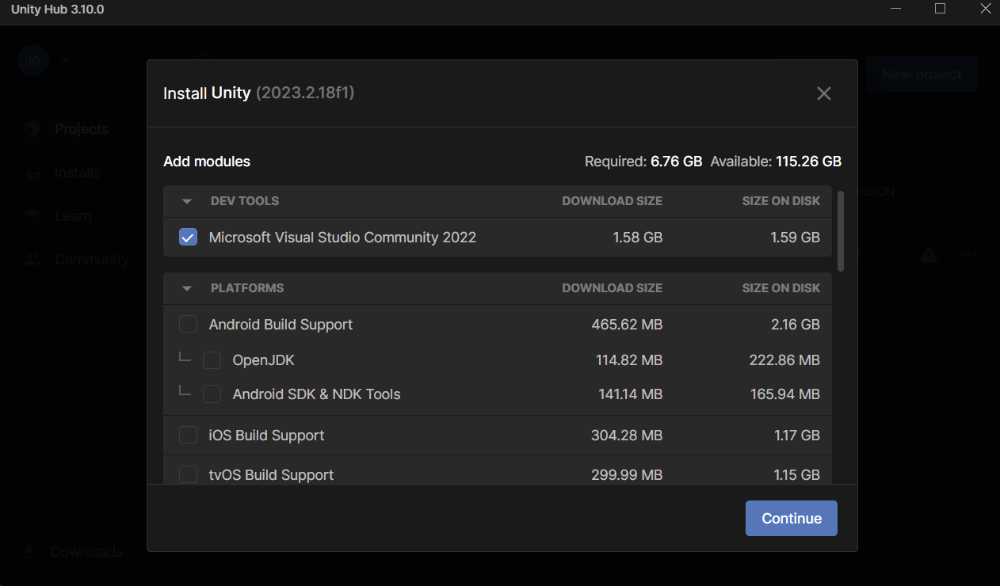

# Getting Started

## Downloading

* Unity is roughly 5.21 GB
* MoSimBuilder is roughly 1.65 GB
* These are estimates and untested

### The first step is to download Unity Hub and Git

<h5>(Unity Hub is the application that is used to edit Unity applications, such as MoSimBuilder)</h5>

* [Download Here](https://unity.com/download)
* Once installed open the app.
* Use a personal licence
* DO NOT install editor versions during setup
* [Download Git Here](https://git-scm.com/install/windows)

### The Second Step is to download the MoSimBuilder source. This can be done in a couple ways

* <h4>Simple install</h4>
    * Install from the main MoSimBuilder GitHub page using Code -> Download Zip
    * Go to your downloads folder and unzip to a location
* <h4>_advanced install_</h4>
  (optionally fork first)
    * Open the GitHub Desktop app
    * File -> Clone Repository -> fill out fields

### The final Step is to let Unity Hub install the correct version of Unity for you

* In the unity hub app click the `Add` button in the top right

* Next select the project from your disk
* Double click your project folder to open the outer layer, then select the folder with the name MoSimBuilder -
  V0.0.....
* If you selected properly is will ask you if you want to install the correct version of Unity, click yes.
* It will then ask you ask you about adding modules, the default is all that you need checked.
  
* you can now open the project once the download is complete. NOTE: The editor takes a long time to download.

### Updating

* If you used the advanced install simply fetch from , then pull the origin on the GitHub Desktop app
* If you used the simple install you will need to start from scratch.

# [A Quick Tour](AQuickTour.md)

## Blue text in large font indicates a link to the next step in the documentation. Click the blue words to continue learning about Builders inner workings
