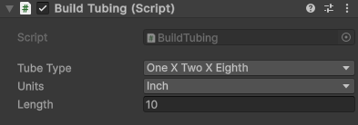
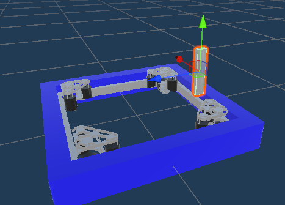
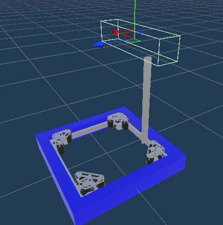
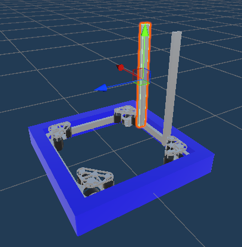
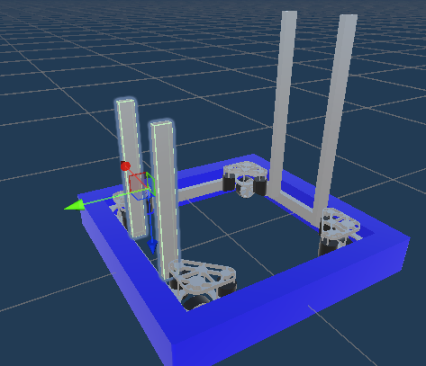
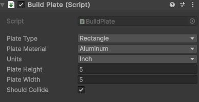
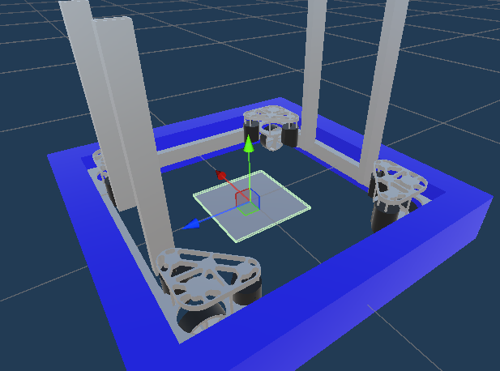
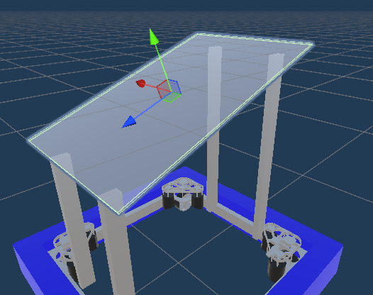
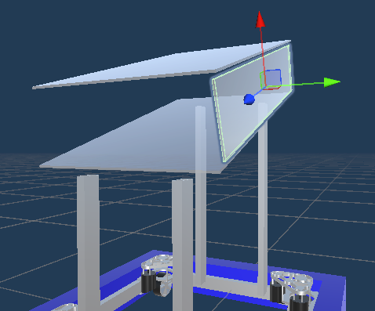
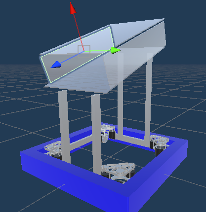

# Making Robots pretty

Builder features a number of "parts libraries" that allow for decorating robots.

Let's decorate the kitbot we made in the last page.

## Creating New Parts

### Tubing:

* Start by creating a new object in the `Hierarchy`
* Once you've created it, navigate to its inspector and add a new `BuildTubing` script
* Click it, and the tubing should appear at the prefab's position as well as the script options opening up in the
  inspector
* There are a few customization options for the `BuildTubing` script:
    * `Tube Type`: The type/size of tubing to use
    * `Units`: The units to use for the following input
    * `Length`: The length of the tubing, in the units selected above
      
* For our kitbot, we'll create the script and start by rotating and moving the component to be under one of the corners
  of the intake node
  
* Once it's in position, we'll keep the units as inches and scale up the length of the tubing until it looks good. For
  our kitbot 30 inches seems like a good height
  
* Now that we have one side done, we'll use `ctrl + c` and `ctrl + v` to copy it
* First select the existing tubing game object in the `Hierarchy` and click `ctrl + c` on the keyboard to copy it
* Now click `ctrl + v`
* This will creat an exact copy of the component, including the position data. This means that it'll perfectly overlap
  with the previous tubing
* Click on the new game object in the `Heirarchy` and drag it to the new position on the other half of the robot
  
* Now let's make tubing for the outtake section
* We can utilize copy/paste once again for efficiency
* Once again select the tubing object to copy it, but this time hold `ctrl` and select the other tubing object as well.
  This allows you to select multiple components at the same time
* Now click `ctrl + v` and drag both components to the outtake side
* The outtake node is lower than the intake node, so let's rescale our tubing to the right size
* While both tubings are still selected (or reselect them both with `ctrl`) resize the length in the `Inspector`. 20
  inches seems good for our kitbot
  

### Plates

* Next let's add some plates to the coral housing/transfer system
* To create a plate, we'll create another object in the `Hierarchy` but this time, we'll add a `BuildPlate` script
  instead
* You'll immediately notice that `BuildPlate` has a few more options than `BuildTubing` does
    * `Plate Type`: The shape of the plate
    * `Plate Material`: The Material of the plate
    * `Units`: The units for the height/width
    * `Plate Height`: The height of the plate
    * `Plate Width`: The width of the plate
    * `Should Collide`: If the plate should have collisions or not
      
* For our kitbot, we'll start with the base plate connecting all four tubes
* Let's keep it rectangular and change the material to polycarb
  
* Next let's move it up and angle it to fit between the tubing. 20 degrees rotation in the x-axis looks fine at about
  0.7 meters above the ground (y-axis)
  
* Now, let's scale the height and width to match the tubing distances. A width of 20 inches and a height of 30 inches
  looks pretty good
  
* Finally, we'll make sure `Should Collide` is checked because we want it to collide with the game pieces and other
  robot components
* Now that we've already made one plate, let's copy it just like we did with the tubing for the top plate
* Select the game object in the `Hierarchy` and use `ctrl + c` and `ctrl + v`
* Move the new plate so that it's directly above the bottom one
  
* Now let's create the side plates
* Let's copy the top plate because it has some values we can keep and edit it from there
* Once it's copied, we'll rotate it 90 degrees on the z-axis to make it perpendicular to the other plates
* We'll also resize the width to ~7 and move it so that it bridges the gap between the two plates
  
* Now to finish up, we'll copy the side plate we just made onto the other side of the robot
  

# [Continue Learning](FurtherReading.md)
