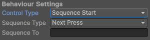
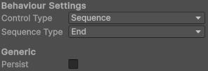

# Setpoints

### Builder Beta utilizes a setpoint system for motion control. This means that each position that any mechanism will move to corresponds to a setpoint which contains other information and features

#### All Setpoints contain the following:

* `Name`
* `Control Type`
* `Point`
* `Keyboard and Controller Button`

### Names

* All setpoints have unique names
* Names can be reused for different mechanisms, but cannot be reused inside the same mechanism
* Names are used for readability, and sequencing (which is covered under [Control Types](#control-types))

### Control Types

* Control types determine when the Setpoint is activated
* All control types are activated when either the keyboard bound, or the controller bound button is clicked
* For example, a Setpoint set to `Toggle` control will be toggled on/off when the button is clicked
* There are 4 control types:
    * `Toggle`: Toggles the setpoint on/off
    * `Hold`: Moves to the setpoint when either button is pressed, and stops moving to it when the button is released
    * `LastPressed`: Toggles the setpoint on, but not off. Useful for keeping multiple mechanisms in sync
    * `Sequences`: Moves through a list of setpoints as the conditions are met
    * There are two kinds of sequence control types:
        * `SequenceStart`: The Setpoint at which the sequence starts at. When either button is clicked, the mechanism
          will go to that Setpoint
        * `Sequence`: A Setpoint that can be sequenced to
          
    * When either sequence mode is selected as the control type, two new fields will be added:
    * `Sequence Type`: Determines when the next item in the sequence should begin
        * `Next Press`: Waits until one of the buttons for the next item in the sequence is pressed
        * `Delay`: Waits the given time and then continues in the sequence
        * `End`: Ends the sequence when the button is clicked
            * Only one sequence can run at a time, so make sure to put an `End` state at the end of each sequence
            * Sequences can also be cancelled in the middle by clicking the button that started the sequence, as long as
              that button is not the next button in the sequence
            * If `End` is selected, an option will be added under `Generic` called `Persist`. Persist will keep the
              mechanism at the last position in the sequence instead of moving it to a new position
              
    * `Sequence To`: The name of the next Setpoint in the sequence

### Set Points

* The `Point` is the actual position that the Setpoint should move to
* For Arms, the Point is the desired angle in degrees
* For Elevators, the Point is the desired distance in the elevator's units

### Controls

* Each Setpoint can only be activated by one controller button and one keyboard button
* All buttons for controller and keyboard are under their respective dropdowns
* Just select the button you want, and start playing!

# [Further Reading](FurtherReading.md)
